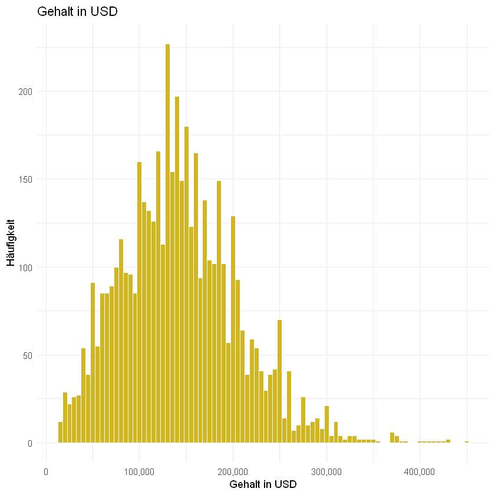
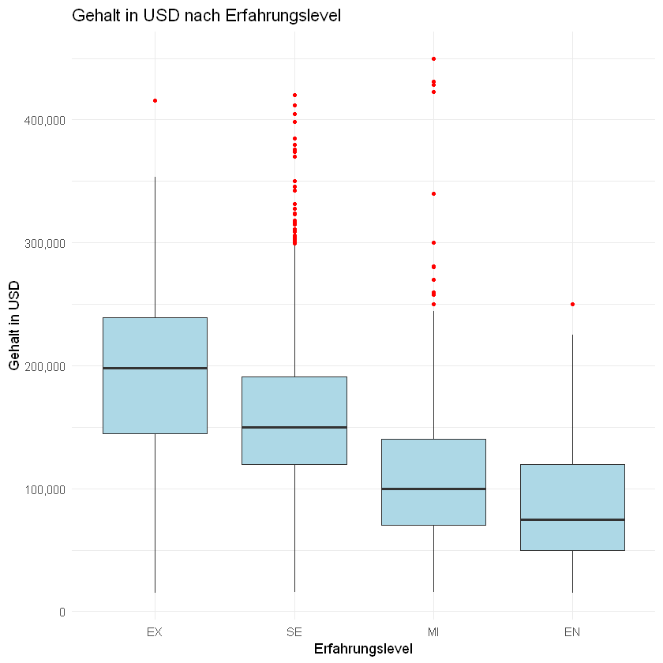
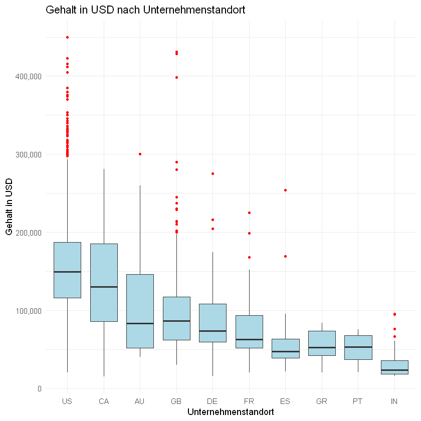
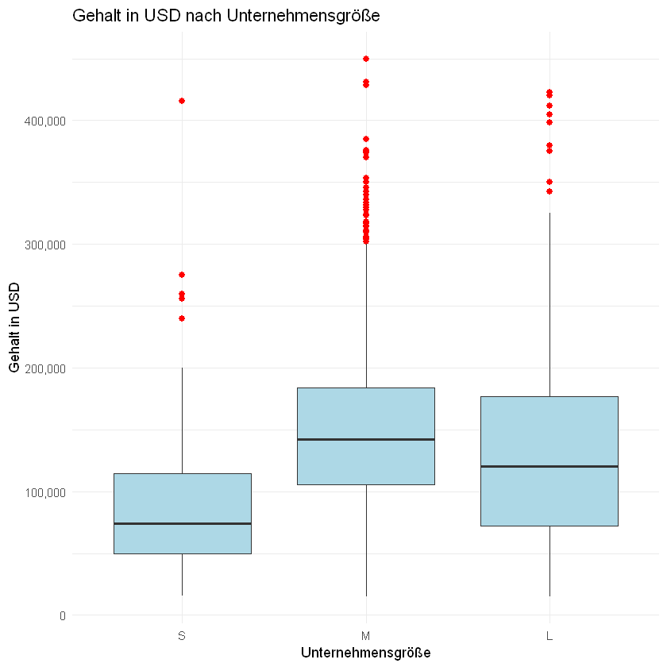
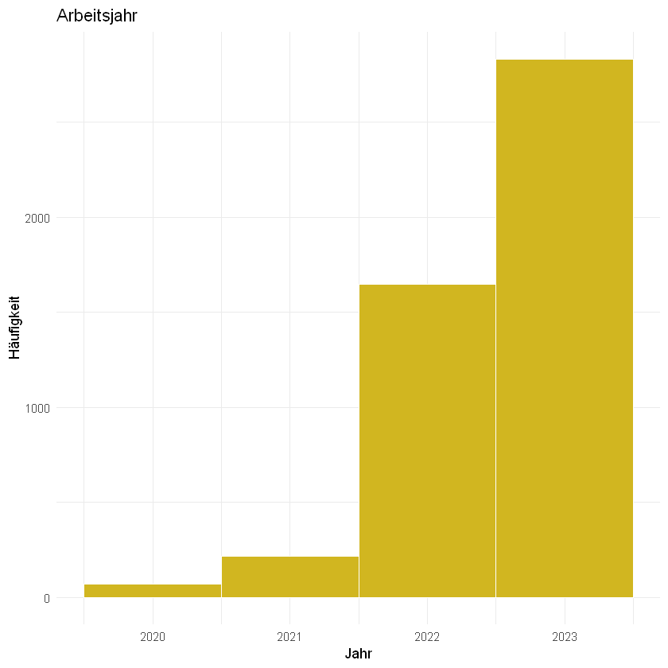
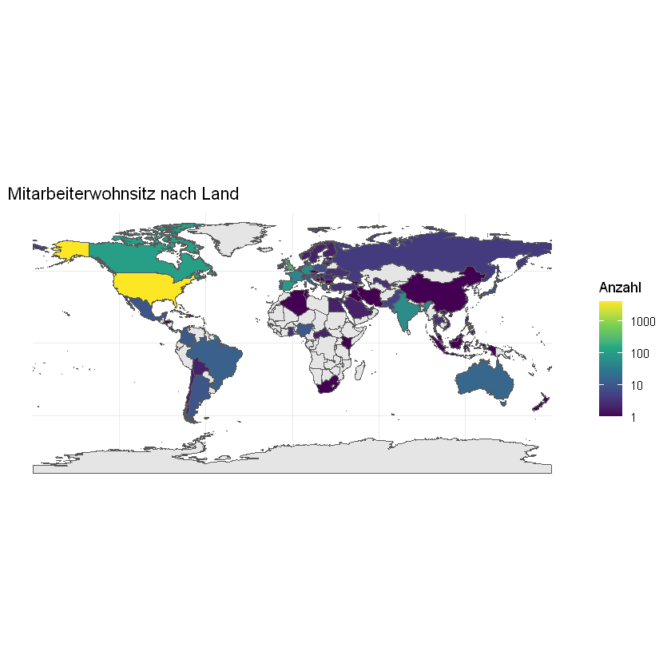
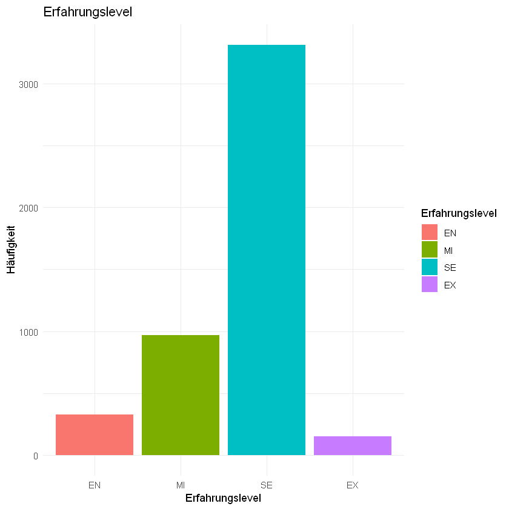
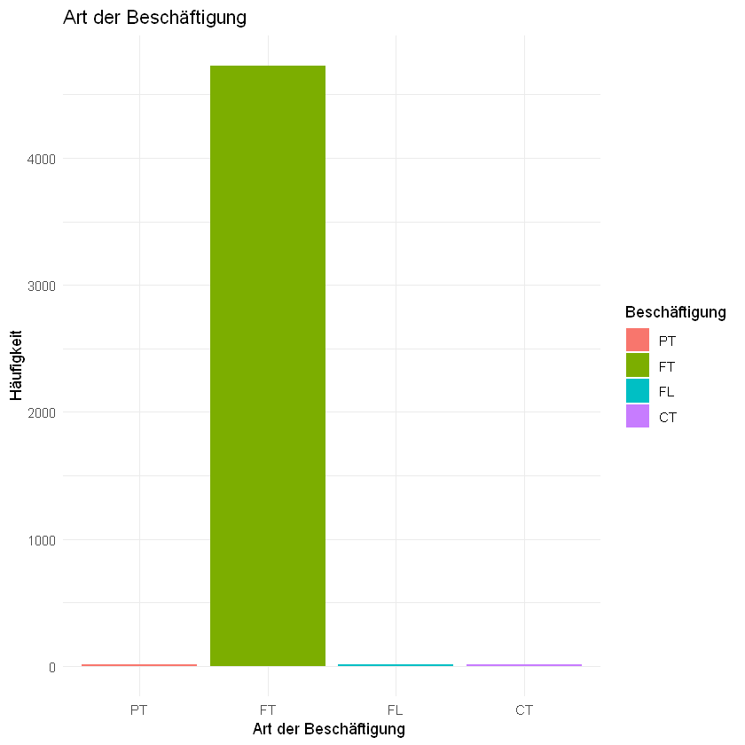
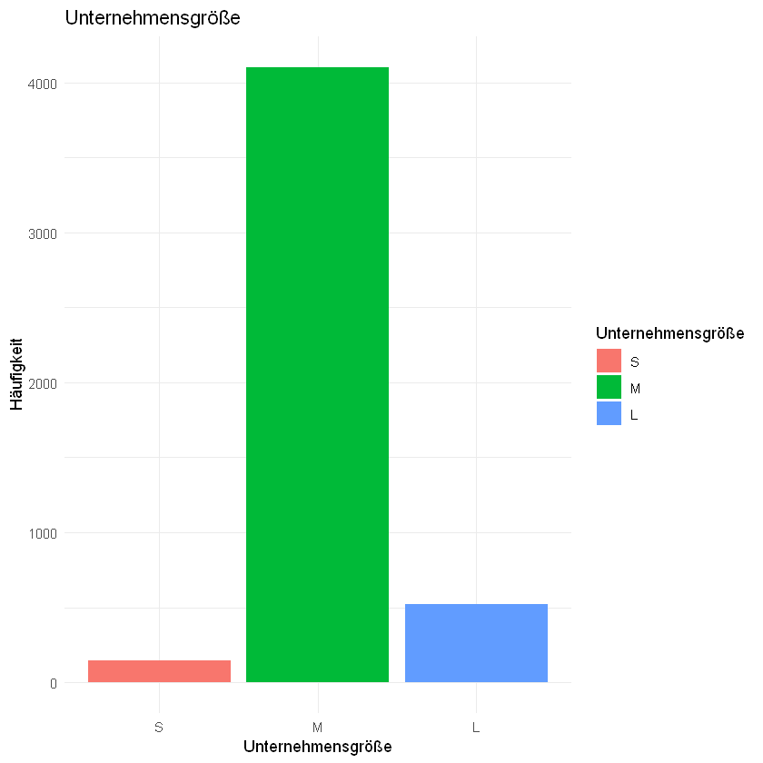
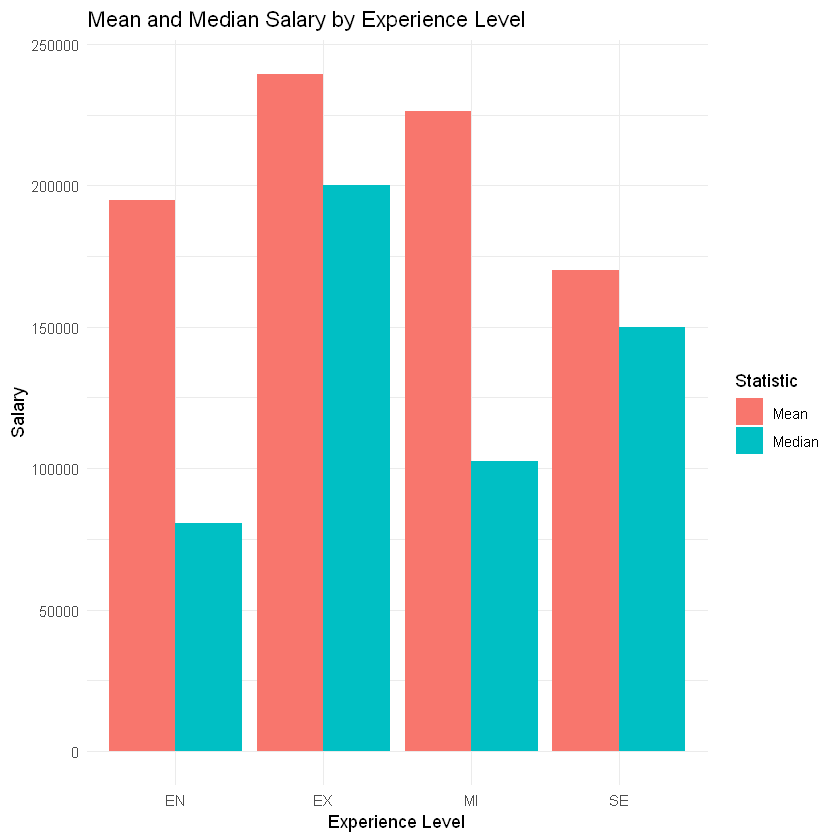

# --->>> [Jupyter Notebook](analysis.ipynb) <<<---

# R Stuff and functions to start up

``` R
# install.packages("reticulate")
# library(reticulate)
# use_condaenv("DataScience")

install.packages("sf", type = "binary")
install.packages("rnaturalearth", type = "binary")
install.packages("rnaturalearthdata", type = "binary")

library(tidyverse)
library(sf)
library(rnaturalearth)
library(rnaturalearthdata)

library(dplyr)
library(ggplot2)
```

    Warning message:
    "Paket 'sf' wird gerade benutzt und deshab nicht installiert"
    Warning message:
    "Paket 'rnaturalearth' wird gerade benutzt und deshab nicht installiert"
    Warning message:
    "Paket 'rnaturalearthdata' wird gerade benutzt und deshab nicht installiert"

# Funktionen für die Analyse

``` R
printf <- function(...) cat(sprintf(...))

Mode <- function(x) {
  ux <- unique(x)
  tab <- tabulate(match(x, ux))
  ux[tab == max(tab)]
}

Haeufigkeit <- function(df, feature) {
  haeufigkeit <- df %>%
    group_by({{ feature }}) %>%
    summarise(absolute = n(), relative = round(n() / nrow(df), 2), prozentual = round(relative * 100))

  haeufigkeit <- arrange(haeufigkeit, desc(absolute))
}

Gini_Simpson <- function(data) {
  sum(data * (1 - data))
}
```

# Daten laden

``` R
df <- read.table("data\\salaries.csv", sep = ",", header = TRUE)
df
mode(df)
```

         work_year experience_level employment_type
    1    2023      SE               FT             
    2    2023      MI               FT             
    3    2023      MI               FT             
    4    2023      SE               FT             
    5    2023      SE               FT             
    6    2023      SE               FT             
    7    2023      SE               FT             
    8    2023      SE               FT             
    9    2023      SE               FT             
    10   2023      EX               FT             
    11   2023      EX               FT             
    12   2023      SE               FT             
    13   2023      SE               FT             
    14   2023      SE               FT             
    15   2023      SE               FT             
    16   2023      SE               FT             
    17   2023      SE               FT             
    18   2023      SE               FT             
    19   2023      SE               FT             
    20   2023      SE               FT             
    21   2023      SE               FT             
    22   2023      SE               FT             
    23   2023      SE               FT             
    24   2023      SE               FT             
    25   2023      SE               FT             
    26   2023      SE               FT             
    27   2023      SE               FT             
    28   2023      SE               FT             
    29   2023      SE               FT             
    30   2023      SE               FT             
    ...  ...       ...              ...            
    4737 2021      EN               FT             
    4738 2021      SE               FT             
    4739 2020      SE               FT             
    4740 2020      MI               FT             
    4741 2021      MI               FT             
    4742 2021      EN               FT             
    4743 2020      SE               FT             
    4744 2020      MI               FT             
    4745 2021      MI               FT             
    4746 2021      SE               FT             
    4747 2021      MI               FT             
    4748 2021      MI               FT             
    4749 2021      MI               FT             
    4750 2021      MI               FT             
    4751 2021      MI               FT             
    4752 2020      SE               FT             
    4753 2020      MI               FT             
    4754 2020      MI               FT             
    4755 2020      MI               FT             
    4756 2020      SE               FT             
    4757 2021      SE               FT             
    4758 2021      MI               FT             
    4759 2021      MI               FT             
    4760 2021      MI               FT             
    4761 2021      SE               FT             
    4762 2020      SE               FT             
    4763 2021      MI               FT             
    4764 2020      EN               FT             
    4765 2020      EN               CT             
    4766 2021      SE               FT             
         job_title                          salary  salary_currency salary_in_usd
    1    Software Data Engineer             210000  USD             210000       
    2    Machine Learning Research Engineer  90000  USD              90000       
    3    Data Analyst                        55000  EUR              59401       
    4    Analytics Engineer                  90000  USD              90000       
    5    Analytics Engineer                  84000  USD              84000       
    6    Data Analyst                       160000  USD             160000       
    7    Data Analyst                       140000  USD             140000       
    8    Analytics Engineer                 221300  USD             221300       
    9    Analytics Engineer                 147500  USD             147500       
    10   Data Engineer                      204500  USD             204500       
    11   Data Engineer                      130000  USD             130000       
    12   Machine Learning Engineer          210000  USD             210000       
    13   Machine Learning Engineer          160000  USD             160000       
    14   Machine Learning Engineer          204500  USD             204500       
    15   Machine Learning Engineer          142200  USD             142200       
    16   Data Analyst                       186600  USD             186600       
    17   Data Analyst                       119800  USD             119800       
    18   Analytics Engineer                 192000  USD             192000       
    19   Analytics Engineer                 151000  USD             151000       
    20   Business Intelligence Engineer     185000  USD             185000       
    21   Business Intelligence Engineer      79600  USD              79600       
    22   Data Scientist                     169000  USD             169000       
    23   Data Scientist                     129300  USD             129300       
    24   Data Engineer                      204500  USD             204500       
    25   Data Engineer                      142200  USD             142200       
    26   Data Engineer                      250000  USD             250000       
    27   Data Engineer                      130000  USD             130000       
    28   Business Intelligence Engineer     210000  USD             210000       
    29   Business Intelligence Engineer     170000  USD             170000       
    30   Analytics Engineer                 221300  USD             221300       
    ...  ...                                ...     ...             ...          
    4737 Business Data Analyst                50000 EUR              59102       
    4738 Principal Data Scientist            147000 EUR             173762       
    4739 Principal Data Scientist            130000 EUR             148261       
    4740 Data Scientist                       34000 EUR              38776       
    4741 Data Scientist                       39600 EUR              46809       
    4742 AI Scientist                       1335000 INR              18053       
    4743 Data Scientist                       80000 EUR              91237       
    4744 Data Scientist                       55000 EUR              62726       
    4745 Data Scientist                      115000 USD             115000       
    4746 Principal Data Scientist            235000 USD             235000       
    4747 Lead Data Analyst                  1450000 INR              19609       
    4748 Data Analyst                         75000 USD              75000       
    4749 Data Analyst                         62000 USD              62000       
    4750 Data Scientist                       73000 USD              73000       
    4751 Data Engineer                        38400 EUR              45391       
    4752 Data Science Manager                190200 USD             190200       
    4753 Data Scientist                      118000 USD             118000       
    4754 Data Scientist                      138350 USD             138350       
    4755 Data Engineer                       130800 USD             130800       
    4756 Machine Learning Engineer            40000 EUR              45618       
    4757 Director of Data Science            168000 USD             168000       
    4758 Data Scientist                      160000 SGD             119059       
    4759 Applied Machine Learning Scientist  423000 USD             423000       
    4760 Data Engineer                        24000 EUR              28369       
    4761 Data Specialist                     165000 USD             165000       
    4762 Data Scientist                      412000 USD             412000       
    4763 Principal Data Scientist            151000 USD             151000       
    4764 Data Scientist                      105000 USD             105000       
    4765 Business Data Analyst               100000 USD             100000       
    4766 Data Science Manager               7000000 INR              94665       
         employee_residence remote_ratio company_location company_size
    1    US                 100          US               L           
    2    SA                 100          SA               M           
    3    DE                  50          DE               L           
    4    US                   0          US               M           
    5    US                   0          US               M           
    6    US                 100          US               M           
    7    US                 100          US               M           
    8    US                   0          US               M           
    9    US                   0          US               M           
    10   US                   0          US               M           
    11   US                   0          US               M           
    12   US                 100          US               M           
    13   US                 100          US               M           
    14   US                   0          US               M           
    15   US                   0          US               M           
    16   US                 100          US               M           
    17   US                 100          US               M           
    18   US                 100          US               M           
    19   US                 100          US               M           
    20   US                   0          US               L           
    21   US                   0          US               L           
    22   US                   0          US               M           
    23   US                   0          US               M           
    24   US                   0          US               M           
    25   US                   0          US               M           
    26   US                   0          US               M           
    27   US                   0          US               M           
    28   US                   0          US               M           
    29   US                   0          US               M           
    30   US                   0          US               M           
    ...  ...                ...          ...              ...         
    4737 LU                 100          LU               L           
    4738 DE                 100          DE               M           
    4739 DE                 100          DE               M           
    4740 ES                 100          ES               M           
    4741 ES                 100          ES               M           
    4742 IN                 100          AS               S           
    4743 AT                   0          AT               S           
    4744 FR                  50          LU               S           
    4745 US                  50          US               L           
    4746 US                 100          US               L           
    4747 IN                 100          IN               L           
    4748 US                   0          US               L           
    4749 US                   0          US               L           
    4750 US                   0          US               L           
    4751 NL                 100          NL               L           
    4752 US                 100          US               M           
    4753 US                 100          US               M           
    4754 US                 100          US               M           
    4755 ES                 100          US               M           
    4756 HR                 100          HR               S           
    4757 JP                   0          JP               S           
    4758 SG                 100          IL               M           
    4759 US                  50          US               L           
    4760 MT                  50          MT               L           
    4761 US                 100          US               L           
    4762 US                 100          US               L           
    4763 US                 100          US               L           
    4764 US                 100          US               S           
    4765 US                 100          US               L           
    4766 IN                  50          IN               L           
         employee_residence_country_name company_location_country_name
    1    United States                   United States                
    2    Saudi Arabia                    Saudi Arabia                 
    3    Germany                         Germany                      
    4    United States                   United States                
    5    United States                   United States                
    6    United States                   United States                
    7    United States                   United States                
    8    United States                   United States                
    9    United States                   United States                
    10   United States                   United States                
    11   United States                   United States                
    12   United States                   United States                
    13   United States                   United States                
    14   United States                   United States                
    15   United States                   United States                
    16   United States                   United States                
    17   United States                   United States                
    18   United States                   United States                
    19   United States                   United States                
    20   United States                   United States                
    21   United States                   United States                
    22   United States                   United States                
    23   United States                   United States                
    24   United States                   United States                
    25   United States                   United States                
    26   United States                   United States                
    27   United States                   United States                
    28   United States                   United States                
    29   United States                   United States                
    30   United States                   United States                
    ...  ...                             ...                          
    4737 Luxembourg                      Luxembourg                   
    4738 Germany                         Germany                      
    4739 Germany                         Germany                      
    4740 Spain                           Spain                        
    4741 Spain                           Spain                        
    4742 India                           American Samoa               
    4743 Austria                         Austria                      
    4744 France                          Luxembourg                   
    4745 United States                   United States                
    4746 United States                   United States                
    4747 India                           India                        
    4748 United States                   United States                
    4749 United States                   United States                
    4750 United States                   United States                
    4751 Netherlands                     Netherlands                  
    4752 United States                   United States                
    4753 United States                   United States                
    4754 United States                   United States                
    4755 Spain                           United States                
    4756 Croatia                         Croatia                      
    4757 Japan                           Japan                        
    4758 Singapore                       Israel                       
    4759 United States                   United States                
    4760 Malta                           Malta                        
    4761 United States                   United States                
    4762 United States                   United States                
    4763 United States                   United States                
    4764 United States                   United States                
    4765 United States                   United States                
    4766 India                           India                        

    [1] "list"

# Gehalt in USD

``` R
ggplot(data = df, aes(x = salary_in_usd)) +
  geom_histogram(binwidth = 5000, fill = "#d1b620", color = "white") +
  labs(title = "Gehalt in USD", x = "Gehalt in USD", y = "Häufigkeit") +
  scale_x_continuous(labels = scales::comma) +
  theme_minimal()
```



rechtsschief / linkssteil

``` R
print("Zusammenfassung:")
summary(df$salary_in_usd)
print("Standardabweichung:")
sd(df$salary_in_usd)
```

    [1] "Zusammenfassung:"

       Min. 1st Qu.  Median    Mean 3rd Qu.    Max. 
      15000  100000  140000  143427  182500  450000 

    [1] "Standardabweichung:"

    [1] 62667.24

Min: Geringster Wert im Datensatz  
Max: Höchster Wert im Datensatz  
1st Quartil: 25 % Der Werte sind kleiner als 1st Quartil, 75 % der Werte
größer  
3rd Quartil: 75 % Der Werte sind kleiner als 1st Quartil, 25 % der Werte
größer  
Median (Zentralwert): Der Wert, der genau in der Mitte einer
Datenverteilung liegt  
Mean (avg, Durchschnitt, Mittelwert): 2nd Quartil, 50 % Der Werte sind
kleiner als 1st Quartil, 50 % der Werte größer  
Standardabweichung: durchschnittliche Abweichung vom Mittelwert

Grobe Erklärung:  
<https://de.statista.com/statistik/lexikon/definition/106/quantil/>  
<https://de.statista.com/statistik/lexikon/definition/91/mittelwert_und_arithmetisches_mittel/>

Nach experience_level

``` R
df_ex <- df %>%
  group_by(experience_level) %>%
  mutate(mean_salary = mean(salary_in_usd)) %>%
  ungroup() %>%
  mutate(experience_level = reorder(experience_level, -mean_salary))
  

ggplot(df_ex, aes(x = experience_level, y = salary_in_usd)) +
  geom_boxplot(fill = "lightblue", outlier.colour = "red", outlier.size = 1) +
  labs(title = "Gehalt in USD nach Erfahrungslevel", x = "Erfahrungslevel", y = "Gehalt in USD") +
  scale_y_continuous(labels = scales::comma) +
  theme_minimal()
```



Nach company_location 10 länder mit den meisten unternehmen

``` R
df_top_countries <- df %>%
  group_by(company_location) %>%
  count() %>%
  arrange(desc(n)) %>%
  head(10)

df_counties <- df %>%
  group_by(company_location) %>%
  filter(company_location %in% df_top_countries$company_location) %>%
  mutate(mean_salary = mean(salary_in_usd)) %>%
  ungroup() %>%
  mutate(company_location = reorder(company_location, -mean_salary))

ggplot(df_counties, aes(x = company_location, y = salary_in_usd)) +
  geom_boxplot(fill = "lightblue", outlier.colour = "red", outlier.size = 1) +
  labs(title = "Gehalt in USD nach Unternehmenstandort", x = "Unternehmenstandort", y = "Gehalt in USD") +
  scale_y_continuous(labels = scales::comma) +
  theme_minimal()
```



Nach company_size

``` R
size_order <- c('S', 'M', 'L')

df_cz <- df %>%
  mutate(company_size = factor(company_size, levels = size_order)) %>%
  group_by(company_size)

ggplot(df_cz, aes(x = company_size, y = salary_in_usd)) +
  geom_boxplot(fill = "lightblue", outlier.colour = "red", outlier.size = 2) +
  labs(title = "Gehalt in USD nach Unternehmensgröße", x = "Unternehmensgröße", y = "Gehalt in USD") +
  scale_y_continuous(labels = scales::comma) +
  theme_minimal()
```



Spearman Correlation

# Work Year

``` R
ggplot(data = df, aes(x = work_year)) +
  geom_histogram(binwidth = 1, fill = "#d1b620", color = "white") +
  labs(title = "Arbeitsjahr", x = "Jahr", y = "Häufigkeit") +
  theme_minimal()
```



``` R
print("Zusammenfassung:")
summary(df$work_year)
print("Standardabweichung:")
sd(df$work_year)
```

    [1] "Zusammenfassung:"

       Min. 1st Qu.  Median    Mean 3rd Qu.    Max. 
       2020    2022    2023    2023    2023    2023 

    [1] "Standardabweichung:"

    [1] 0.6549009

# employee_residence

``` R
world <- ne_countries(scale = "medium", returnclass = "sf")
agg_emp_data <- df %>%
    group_by(employee_residence) %>%
    summarise(emp_count = n())

# Join employee data with world map data
world_with_emp_data <- world %>%
    left_join(agg_emp_data, by = c("iso_a2" = "employee_residence"))

ggplot(data = world_with_emp_data) +
    geom_sf(aes(fill = emp_count)) +
    scale_fill_viridis_c(
        option = "viridis", trans = "log10",
        na.value = "gray90", guide = guide_colorbar(title = "Anzahl")
    ) +
    labs(title = "Mitarbeiterwohnsitz nach Land") +
    theme_minimal()
```



``` R
m <- Mode(df$employee_residence_country_name)
printf("Mode: %s\n", m)
```

    Mode: United States

# company_location

``` R
agg_company_data <- df %>%
    group_by(company_location) %>%
    summarise(comp_count = n())

# Join employee data with world map data
world_with_company_data <- world %>%
    left_join(agg_company_data, by = c("iso_a2" = "company_location"))

ggplot(data = world_with_company_data) +
    geom_sf(aes(fill = comp_count)) +
    scale_fill_viridis_c(
        option = "viridis", trans = "log10",
        na.value = "gray90", guide = guide_colorbar(title = "Anzahl")
    ) +
    labs(title = "Unternehmensanzahl nach Land") +
    theme_minimal()
```


``` R
m <- Mode(df$company_location_country_name)
printf("Mode: %s\n", m)
```

    Mode: United States

# Experience Level

``` R
exp_order <- c('EN', 'MI', 'SE', 'EX')

df_exp_ordered <- df %>%
  mutate(experience_level = factor(experience_level, levels = exp_order))

ggplot(data = df_exp_ordered, aes(x = experience_level, fill = experience_level)) +
  geom_bar() +
  labs(title = "Erfahrungslevel", x = "Erfahrungslevel", y = "Häufigkeit", fill = "Erfahrungslevel") +
  theme_minimal()
```



``` R
m <- Mode(df$experience_level)
printf("Mode: %s\n", m)
```

    Mode: SE

# employment_type

``` R
emp_order <- c('PT', 'FT', 'FL', 'CT')

df_emp_ordered <- df %>%
  mutate(employment_type = factor(employment_type, levels = emp_order))

ggplot(data = df_emp_ordered, aes(x = employment_type, fill = employment_type)) +
  geom_bar() +
  labs(title = "Art der Beschäftigung", x = "Art der Beschäftigung ", y = "Häufigkeit", fill = "Beschäftigung") +
  theme_minimal()
```



``` R
m <- Mode(df$employment_type)
printf("Mode: %s\n", m)
```

    Mode: FT

# company_size

``` R
size_order <- c('S', 'M', 'L')

df_cs <- df %>%
  mutate(company_size = factor(company_size, levels = size_order)) %>%
  group_by(company_size)

ggplot(data = df_cs, aes(x = company_size, fill = company_size)) +
  geom_bar() +
  labs(title = "Unternehmensgröße", x = "Unternehmensgröße", y = "Häufigkeit", fill = "Unternehmensgröße") +
  theme_minimal()
```



# salary_currency

``` R
modalwert <- Mode(df$salary_currency)
printf("Mode: %s\n", modalwert)

haeufigkeit <- Haeufigkeit(df, salary_currency)
"Häufigkeiten:"
haeufigkeit

gini <- Gini_Simpson(haeufigkeit$relative)
printf("Gini: %f", gini)
```

    Mode: USD

    [1] "Häufigkeiten:"

       salary_currency absolute relative prozentual
    1  USD             4200     0.88     88        
    2  EUR              250     0.05      5        
    3  GBP              198     0.04      4        
    4  INR               43     0.01      1        
    5  CAD               26     0.01      1        
    6  AUD               10     0.00      0        
    7  PLN                6     0.00      0        
    8  SGD                6     0.00      0        
    9  CHF                4     0.00      0        
    10 JPY                4     0.00      0        
    11 DKK                3     0.00      0        
    12 HUF                3     0.00      0        
    13 BRL                2     0.00      0        
    14 NOK                2     0.00      0        
    15 THB                2     0.00      0        
    16 TRY                2     0.00      0        
    17 CLP                1     0.00      0        
    18 HKD                1     0.00      0        
    19 ILS                1     0.00      0        
    20 MXN                1     0.00      0        
    21 ZAR                1     0.00      0        

    Gini: 0.211300

# company_size

``` R
m <- Mode(df$company_size)
printf("Mode: %s\n", m)
```

    Mode: M

# Korrelationen

[Skalen](https://wissenschafts-thurm.de/wp-content/uploads/2016/09/Skalenniveaus.jpg)

muss in zahlen ausdrückbar sein

``` R
newdf <- df %>% select(where(is.numeric))
```

Pearson's correlation between salary and work_year (nicht gut für Skalen
Kardinalskala, wie hier!)

salary_in_usd ist verhältnis, work_year ordninal

Intervall: -1 \< r \< 1 \[-1 (Antikorrelation), 1 (Korrelation)\]

``` R
correlation <- cor(df$salary_in_usd, df$work_year)
correlation
```

    [1] 0.2172535

Calculate Spearman's rank correlation between remote_ratio and salary

Intervall: -1 \< r \< 1 \[-1 (Antikorrelation), 1 (Korrelation)\]

``` R
correlation <- cor(df$salary_in_usd, df$work_year, method = "spearman")
correlation
```

    [1] 0.204063

Pearson Correlation

``` R
cor(newdf)
```

                  work_year   salary       salary_in_usd remote_ratio
    work_year      1.00000000 -0.092195886  0.217253523  -0.21299049 
    salary        -0.09219589  1.000000000 -0.004254672   0.02551045 
    salary_in_usd  0.21725352 -0.004254672  1.000000000  -0.07687290 
    remote_ratio  -0.21299049  0.025510451 -0.076872897   1.00000000 

``` R
cor(newdf, method = "spearman")
```

                  work_year  salary      salary_in_usd remote_ratio
    work_year      1.0000000  0.15960528  0.20406301   -0.22426536 
    salary         0.1596053  1.00000000  0.92301437   -0.04436938 
    salary_in_usd  0.2040630  0.92301437  1.00000000   -0.07305041 
    remote_ratio  -0.2242654 -0.04436938 -0.07305041    1.00000000 

# Regression

``` R
summary(lm(salary_in_usd ~ work_year, data = df))
```


    Call:
    lm(formula = salary_in_usd ~ work_year, data = df)

    Residuals:
        Min      1Q  Median      3Q     Max 
    -137595  -43172   -3416   36584  358951 

    Coefficients:
                 Estimate Std. Error t value Pr(>|t|)    
    (Intercept) -41902560    2736988  -15.31   <2e-16 ***
    work_year       20789       1353   15.36   <2e-16 ***
    ---
    Signif. codes:  0 '***' 0.001 '**' 0.01 '*' 0.05 '.' 0.1 ' ' 1

    Residual standard error: 61180 on 4764 degrees of freedom
    Multiple R-squared:  0.0472,	Adjusted R-squared:  0.047 
    F-statistic:   236 on 1 and 4764 DF,  p-value: < 2.2e-16

# Anderes

``` R
df_summary <- df %>%
  group_by(experience_level) %>%
  summarize(mean_salary = mean(salary), median_salary = median(salary)) %>%
  gather(key = "statistic", value = "value", mean_salary, median_salary)
df_summary
```

      experience_level statistic     value   
    1 EN               mean_salary   194632.1
    2 EX               mean_salary   239449.3
    3 MI               mean_salary   226226.7
    4 SE               mean_salary   169895.5
    5 EN               median_salary  80500.0
    6 EX               median_salary 200000.0
    7 MI               median_salary 102500.0
    8 SE               median_salary 150000.0

``` R
ggplot(data = df_summary, aes(x = experience_level, y = value, fill = statistic)) +
    geom_bar(stat = "identity", position = "dodge") +
    theme_minimal() +
    labs(y = "Salary", x = "Experience Level", title = "Mean and Median Salary by Experience Level") +
    scale_fill_discrete(name = "Statistic", labels = c("Mean", "Median"))
```



``` R
chisq.test(df$work_year, df$company_size, simulate.p.value = TRUE)
```


    	Pearson's Chi-squared test with simulated p-value (based on 2000
    	replicates)

    data:  df$work_year and df$company_size
    X-squared = 1140.4, df = NA, p-value = 0.0004998


---
# Setup
install miniconda / anaconda
install R, add R to path "C:\Program Files\R\R-4.3.0\bin\x64\"

create new env (named DataScience)

``` shell
conda config --add channels conda-forge   
conda config --set channel_priority strict      
conda search r-base   
conda create -n your_name_here python=3.X     
conda activate your_name_here   
conda install -c conda-forge r-base=4.X.X     
conda install r r-essentials --channel conda-forge
conda install jupyter
```

In console type "R", R Console opens, install jupyter notebook
```shell
install.packages('IRkernel')       
install.packages(c("tidyverse", "sf", "rnaturalearth", "rnaturalearthdata"))
IRkernel::installspec()
``` 


create requirments.txt
`pip list --format=freeze > requirements.txt` in conda env

# Datenaufbereitung
Führe `iso3166_to_countryName.py` aus damit aus dem Ländercode der Ländername erzeugt werden kann, wird im JupyterNotebook benötigt.